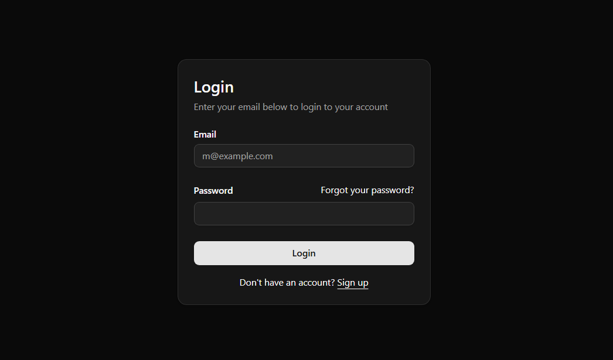
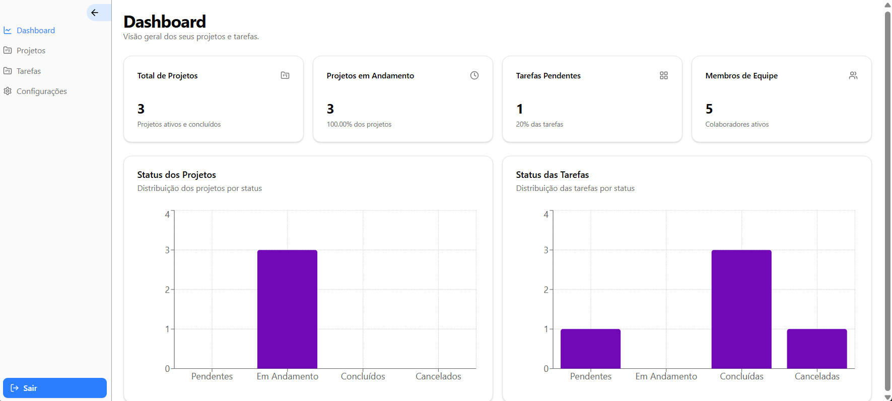
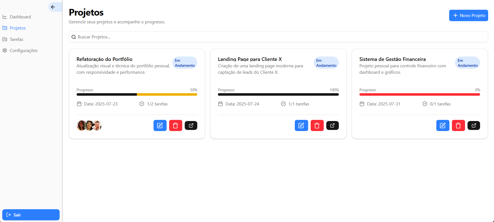
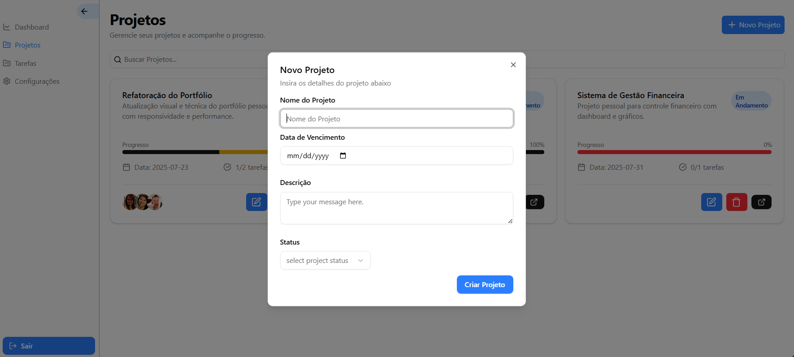
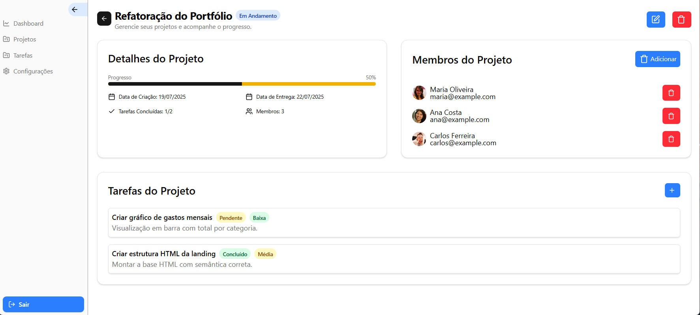
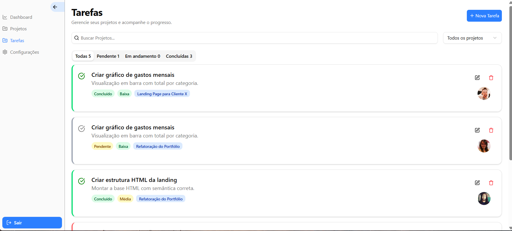
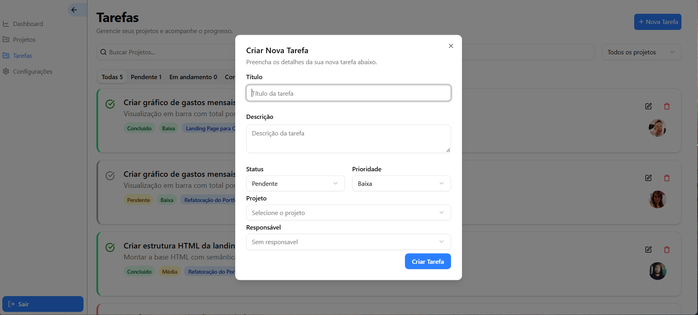
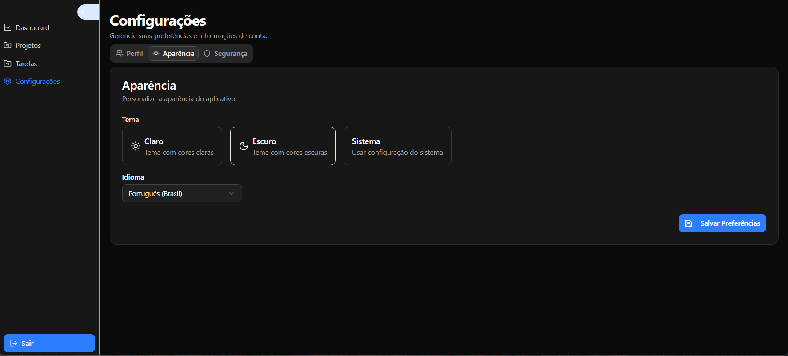

# 📊 Mini CRM - Sistema de Gestão de Projetos e Tarefas

Sistema web de controle e acompanhamento de projetos e tarefas, com foco em freelancers, equipes pequenas e desenvolvedores que desejam gerenciar suas entregas de forma organizada, visual e eficiente.

---

## 🔍 Visão Geral

O **Mini CRM** permite:

- Criar e editar projetos com progresso e status
- Gerenciar tarefas com prioridade, responsáveis e prazos
- Acompanhar métricas no dashboard (tarefas pendentes, status, etc.)
- Editar informações de perfil e preferências do sistema

---

## 🚀 Tecnologias Utilizadas

- **Next.js**
- **Tailwind CSS**
- **Context API**
- **Firebase**

---

## 📸 Imagens do Sistema

## 🔐 Login

> Tela de autenticação simples para entrada no sistema

---

### 📊 Dashboard

> Visão geral dos projetos, tarefas e gráficos de status

---

### 📁 Projetos

> Cards com progresso visual, status e tarefas associadas

---

### 📝 Adicionar Projeto

> Formulário para criação de novos projetos com nome, descrição, prazo

---

### 📌 Detalhes do Projeto

> Visualização completa do projeto selecionado, com progresso e tarefas associadas

---

### 🗒️ Tarefas

> Listagem geral de tarefas com filtros por status, prioridade e responsável

---

### ✅ Adicionar Tarefa

> Formulário para adicionar tarefas com prioridade, status e responsável

---

### ⚙️ Configurações

> Edição de perfil e preferências gerais

---